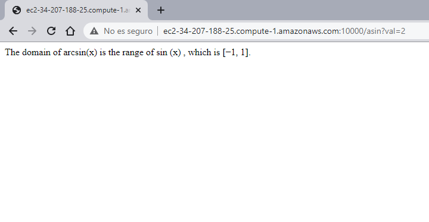
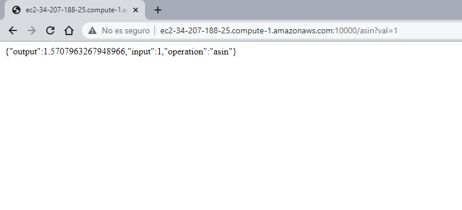
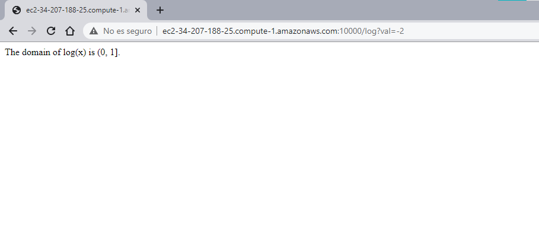
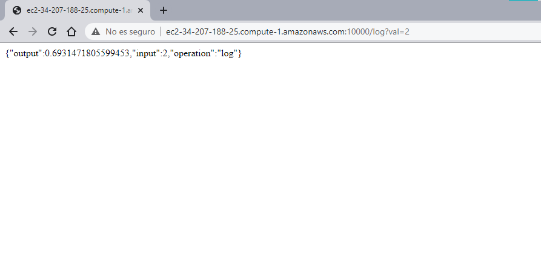

# Código desplegado en EC2 utilizando Docker
## Funcionamiento
Probando el arcoseno de 1:

Probando el logaritmo de 2:

## Imagen en Docker-Hub
[https://hub.docker.com/repository/docker/fede2906b/parcial](https://hub.docker.com/repository/docker/fede2906b/parcial).
## Construido con
- Maven
- Java
- GIT
- Docker
- AWS EC2

## Licencia
federico29/AREP-Parcial2 is licensed under the [GNU General Public License v3.0](https://www.gnu.org/licenses/gpl-3.0.html).

## Autor
Federico Barrios Meneses
