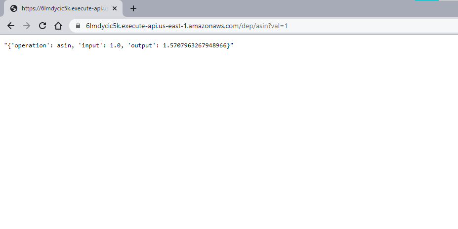
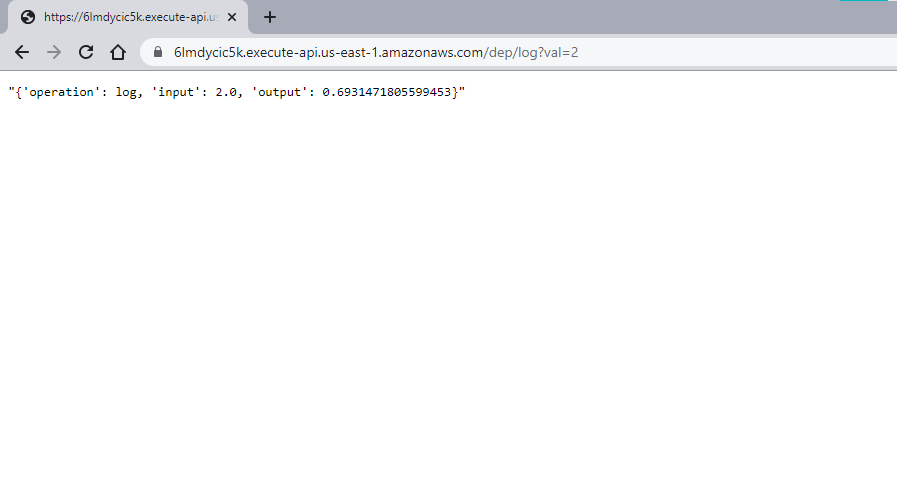

# Verificación de conocimientos: AREP-Tercio 2
## Funcionamiento
Probando el arcoseno de 1:

Probando el logaritmo de 2:

## Instalación
Copiar este repositorio y compilarlo:
```
$ git clone urlrepositorio
$ mvn package
```

## Ejecutar pruebas
Para ejecutar las pruebas ejecute el siguiente comando:
```
$ mvn test
```

## Documentación
Generar la documentación del proyecto:
```
$ mvn javadoc:javadoc
```

## Construido con
- Maven
- Java
- GIT
- Docker
- AWS EC2

## Licencia
federico29/AREP-Parcial2 is licensed under the [GNU General Public License v3.0](https://www.gnu.org/licenses/gpl-3.0.html).

## Autor
Federico Barrios Meneses
